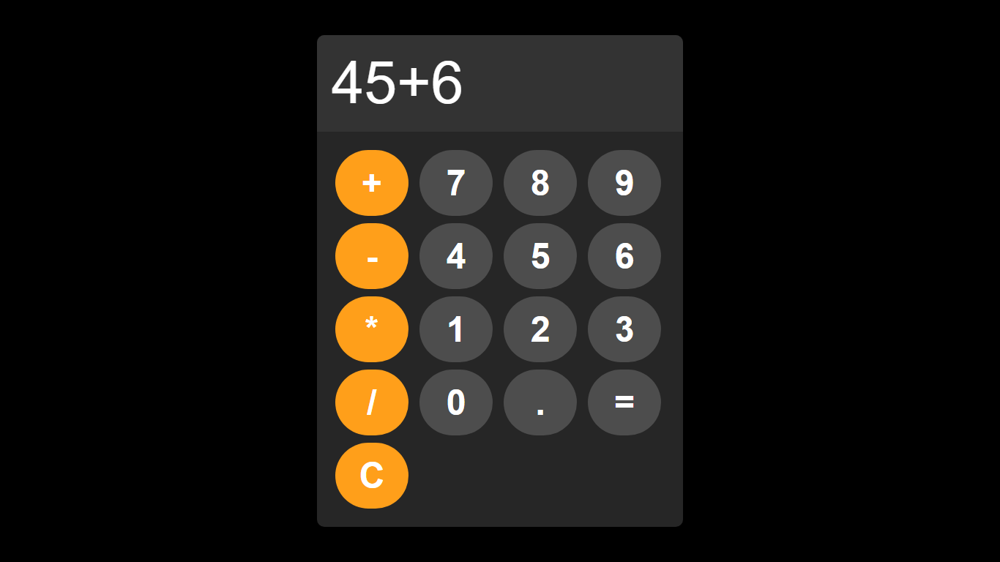

<h1 align="center">🧮 Simple Calculator</h1>

<p align="center">
  
  <br>
  
  
  
</p>

---

## 🧠 Description

**Simple Calculator** is a lightweight, web-based calculator built using **HTML, CSS, and JavaScript**.  
It performs basic arithmetic operations like addition, subtraction, multiplication, and division.  
Includes a clear button to reset all operations instantly. Perfect for beginners learning front-end development or anyone who needs a fast and simple calculator.  

---

## 🚀 Features

| Feature | Description |
|--------|-------------|
| ➕➖✖️➗ Basic Operations | Supports addition, subtraction, multiplication, and division. |
| 🧹 Clear Button | Resets the current input and calculation. |
| 🖥️ Responsive UI | Works on desktop and mobile screens. |
| 💻 Lightweight | Pure HTML, CSS, and JS, no external libraries. |
| 🎨 Interactive Design | Clean and easy-to-use interface for smooth interaction. |

---

## 🖼️ Screenshots

<p align="center">
  
</p>

---

## 📦 Installation

No special environment required — just a web browser!  

```bash
# Clone the repository
git clone https://github.com/YourUsername/simple-calculator.git

# Navigate into the project folder
cd simple-calculator

# Open the calculator in your default browser
# On Linux/macOS
xdg-open index.html

# On macOS alternative
open index.html

# On Windows (PowerShell)
start index.html
